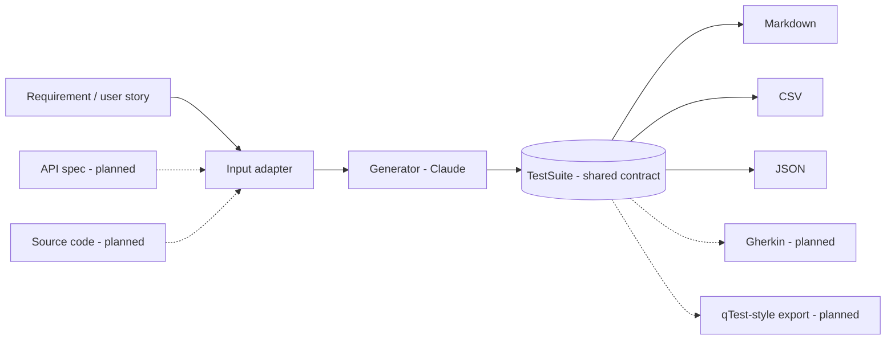

# testgen

**AI-assisted test case generation.** Give `testgen` a requirement or user story
and it produces a structured, review-ready test suite — functional, negative,
boundary, security, and usability cases — that a tester can execute directly or
import into a test-management tool.

Built around a clean, extensible architecture: today it generates test cases from
**requirements**; the same core is designed to take **API specs** and **source
code** as inputs and to export to formats like **Gherkin** or a **qTest-style**
test-management API.

```bash
testgen "As a user, I want to reset my password via an emailed link."
```

---

## Why this exists

Writing good test cases by hand is slow, and coverage is easy to miss under
deadline pressure. `testgen` turns a requirement into a first-class test suite in
seconds — not to replace the tester's judgement, but to give them a thorough,
well-structured starting point they can refine. The output is deliberately
tool-agnostic: Markdown for review, CSV for import, JSON for automation.

## How it works

The pipeline is built so that **inputs and outputs are pluggable** and everything
meets in the middle at one shared data contract (`TestSuite`). That's what lets
new inputs and outputs be added without touching the core.



- **Adapters** (`testgen/adapters/`) normalize any input into a `GenerationContext`.
- **Generator** (`testgen/core/`) prompts Claude and uses structured output to
  return a validated `TestSuite` — no brittle text parsing.
- **Models** (`testgen/models.py`) define the `TestSuite` / `TestCase` contract.
- **Formatters** (`testgen/formatters/`) render the suite for humans or tools.

## Install

Requires Python 3.10+.

```bash
git clone https://github.com/nishant20/testgen.git
cd testgen
python -m venv .venv
# Windows:  .venv\Scripts\activate
# macOS/Linux:  source .venv/bin/activate
pip install -e .
```

## Configuration

`testgen` calls the Anthropic API, so it needs a key:

```bash
# Windows (PowerShell)
$env:ANTHROPIC_API_KEY = "sk-ant-..."

# macOS/Linux
export ANTHROPIC_API_KEY="sk-ant-..."
```

Pick a different model with `--model` (default: `claude-opus-4-8`).

## Usage

```bash
# From an argument
testgen "As a user, I want to reset my password via an emailed link."

# From a file
testgen --file examples/password_reset.txt

# From stdin
cat examples/password_reset.txt | testgen

# Choose an output format and write to a file
testgen --file examples/password_reset.txt --format csv --output cases.csv

# Steer the coverage
testgen --file examples/password_reset.txt --instructions "focus on security and boundary cases"
```

**Output formats:** `markdown` (default), `csv`, `json`.

Each test case includes an ID, title, type, priority, preconditions, concrete
test data, numbered steps with expected results, and tags.

## Web UI

A local web UI wraps the same pipeline as the CLI: enter a requirement, generate
a suite, edit test cases in the browser, then export.

```bash
pip install -e ".[web]"
testgen serve
```

This opens `http://127.0.0.1:8000` (use `--host`/`--port`/`--no-browser` to
change that). It uses the same `ANTHROPIC_API_KEY` as the CLI.

## Development

```bash
pip install -e ".[web,dev]"
pytest
```

The formatter tests run offline (no API calls), so they're a fast, green baseline.

## Roadmap

- [x] Requirement / user-story input
- [x] Markdown, CSV, JSON output
- [ ] **Source-code input adapter** — read an automation framework and derive test
      cases from its test code and data
- [ ] API spec (OpenAPI/Swagger) input adapter
- [ ] Gherkin output
- [ ] **Test-management exporter** — push generated cases to a qTest-style REST API
      (create + map), with execution hooks
- [x] Optional web UI

## About

`testgen` is the clean, general-purpose foundation for an AI test-automation agent
— reading test material and generating executable cases. It's built to grow into a
source-code-reading, test-management-integrated agent while staying vendor-neutral
and free of any proprietary code. See [`docs/windsurf-prompts.md`](docs/windsurf-prompts.md).

## License

MIT
